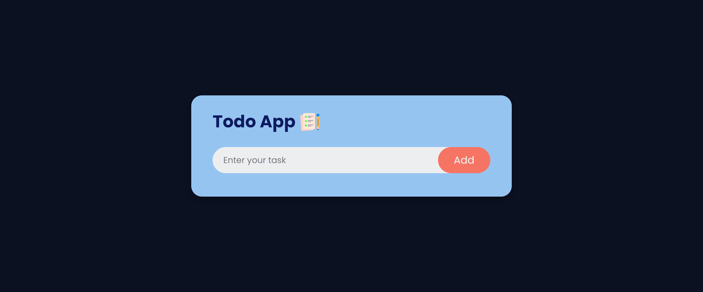

# ToDo-App  

This is a Todo app where user can create and delete there todo list .

## 🛠 Technologies Used
  - HTML - Hyper Text Markup Language
  - CSS - Cascadeing Spread Sheet
  - JS - Java Script

## ✍️ Author and 📞 Contact

  [Instagram](https://www.instagram.com/ravibatalvi752/)
   

## 📝 Features

- Good UI/UX Design
- you can add your todo tasks and you can also delete them.
- Hosted on Netlify and set up in production

## 🤔 What i have learnt By working on this project
1. How to use local storage for data saving with the help of key value pair

## [Live Link](https://todo-app-p03.netlify.app/)

## Demo In Laptop

## 😌 Honest Time to finish the project

I have taken nearly 5 hours to complete this project .

## 👀 Feedback
If you have any feedback, please reach out to us at ravibatalvi55@gmail.com
